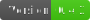
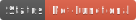

# Godot UI Animation Framework

    <a 
    <a 

An easy to work with, modular, extendable framework for animating all the UI and other things in your project.

# Vision
I am building a framework to make animating both large and small chunks of UI as easy and effective as possible. By using a modular building block approach, with as much automation to create a low/no-code end-user experience, I hope to solve this challenge.

# Dependencies & Contributions
A huge shout-out to the projects who were generous enough to release their code under MIT License as to allow me to use and take inspiration for my project.
## Dependencies
[GD-Action](https://github.com/duongvituan/godot-action-animation-framework)
All the animations are handled by this awesome plugin.
## Contributions
[Godot Awesome Splash](https://github.com/duongvituan/godot-awesome-splash)
This project was the inspiration for what I've built. As well as helping me discover GDAction, I also took some shaders from here.