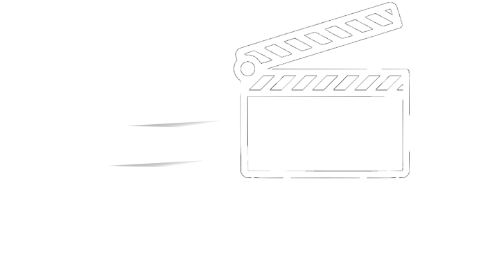

    

    
    
    

A plugin for Godot to make animating UI, cameras, swarms of nodes and anything else you can imagine as easy and effective as possible. 

# Features
- Manage everything from one GUI panel
- Combine [GDActions](https://github.com/duongvituan/godot-action-animation-framework) and shader effects in unlimited ways
- No Code

# Upcoming Features
- 3D Support
- Live Preview

# 🥰 Credits
A huge shout-out to the projects who were generous enough to release their code under MIT License as to allow me to use and take inspiration for my project.
### Dependencies
[GD-Action](https://github.com/duongvituan/godot-action-animation-framework)
All the animations are handled by this awesome plugin.

[Godot Sprite Shader](https://github.com/duongvituan/godot-sprite-shader)
This provides almost all the default shaders.
### Contributions
[Godot Awesome Splash](https://github.com/duongvituan/godot-awesome-splash)
This project was the inspiration for what I've built. As well as helping me discover GDAction, I also took some shaders from here.